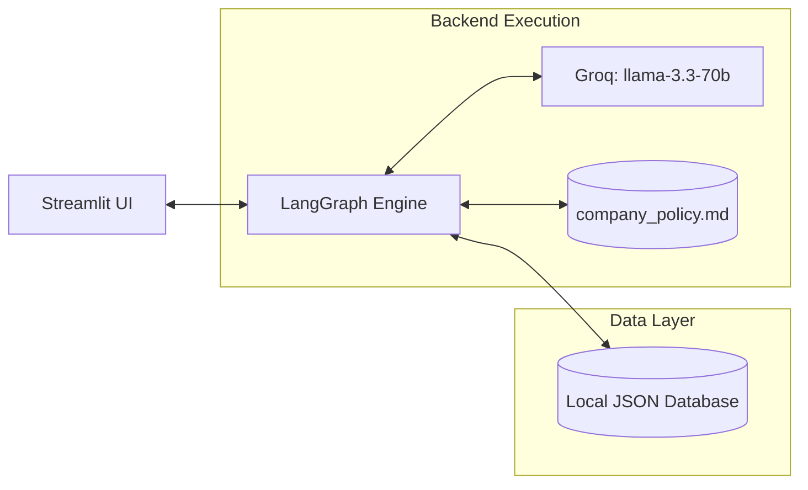
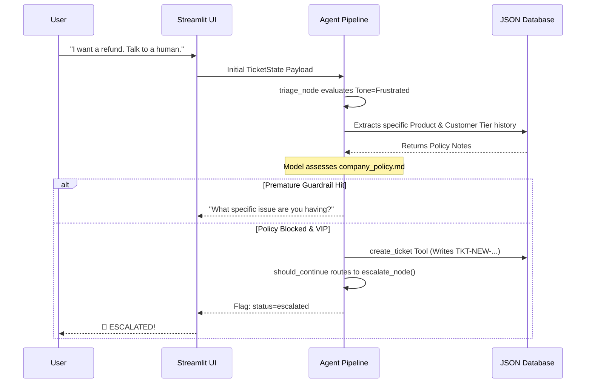

# ShopWave Support Agent - Architecture Breakdown

This file outlines the internal mechanics, structural pipelines, and logic flows powering the ShopWave Autonomous AI Support Agent. 

## 1. High-Level Component Stack

The system embraces a strictly decoupled design: separating the user interface, state management, localized logic, and database schemas.



* **Streamlit UI (`app.py`)**: Intercepts chat and visually manages escalations without crashing the backend loop. 
* **LangGraph Engine (`agent.py`)**: The central state-machine that routes information, processes history, and builds JSON context before querying the model.
* **LLM Engine**: Powers the semantic reasoning, utilizing specific tool calls via the Groq endpoint.
* **Company Policy (`company_policy.md`)**: A deterministic rulebook pushed into the prompt payload context.
* **JSON Database (`database.py`)**: Local JSON structures mocking a standard SQL database for isolated writes and reads.

---

## 2. Core LangGraph State Machine

The agent doesn't just guess responses. It is built as a cyclic graph (state machine) using `LangGraph`. Below is the exact logical routing mapping out how the agent decides its next behavior based on conditional edges.

```mermaid
graph TD
    classDef startend fill:#4ECDC4,stroke:#333,stroke-width:2px;
    classDef node fill:#1A1A1A,stroke:#FF6B6B,stroke-width:2px,color:#fff;
    classDef tools fill:#FFD166,stroke:#333,stroke-width:2px,color:#000;

    Start((START)):::startend --> Triage(triage_node):::node
    
    Triage --> Resolve(resolve_node):::node
    
    Resolve --> COND{should_continue}
    
    COND -- calls_tool --> Tools[/Tool Node/]::tools
    Tools --> Resolve
    
    COND -- outputs_'ESCALATE_TO_HUMAN' --> Escalate(escalate_node):::node
    COND -- standard_reply --> End((END)):::startend
    
    Escalate --> End
```

### Node Explanations
1. **`triage_node`**: This acts as a gateway proxy. It intercepts the raw user text and statically extracts data (`category`, `tone`, `email`, `order_id`). It then immediately interfaces with the database to inject "Old Customer/Issue" flags before the core model ever talks.
2. **`resolve_node`**: The core "brain" of the agent. It securely interpolates `company_policy.md` and context parameters dynamically, then prompts the model to make a decision.
3. **`Tool Node`**: Automatically binds tools. If the `resolve_node` wants to execute a structural tool (e.g. `process_refund`, `create_ticket`), LangGraph routes it here, builds the JSON payload, executes Python, and returns the result back to `resolve_node` for final translation.
4. **`escalate_node`**: A secure exit hatch. If the agent hits a policy blockade, it terminates the generative loop, outputs an escalation summary to `app.py`, and halts further LLM inferences until manual review.

---

## 3. Escalation & Guardrail Workflows

To prevent premature escalation or prompt hijacking, the architecture employs aggressive sequence routing:


