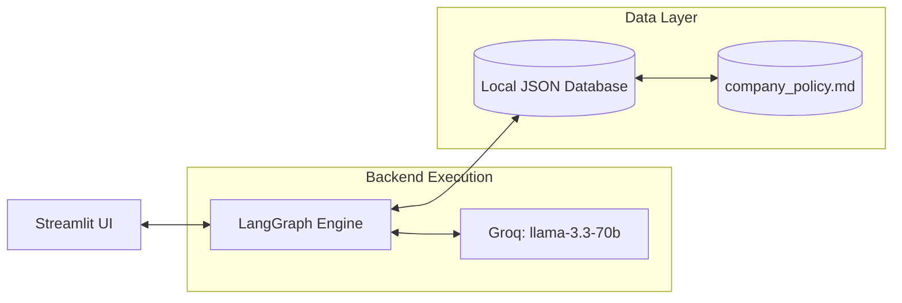
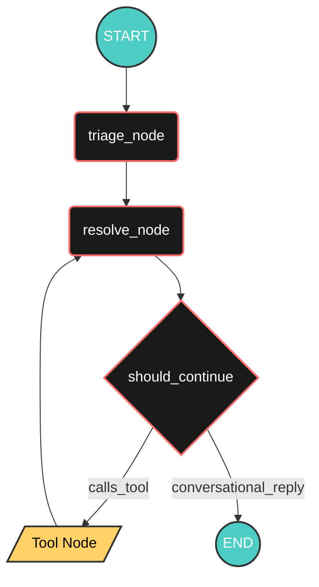
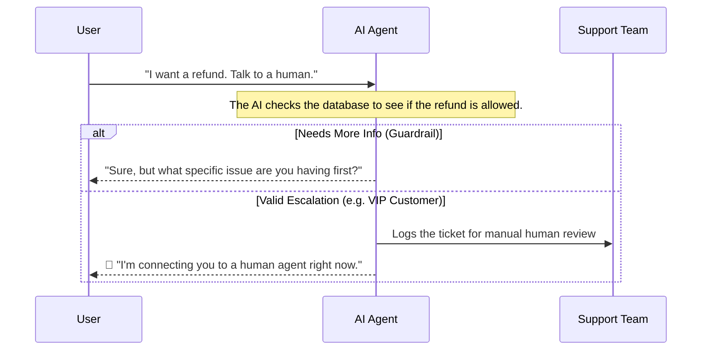

# ShopWave Support Agent - Architecture Breakdown

This file outlines the internal mechanics, structural pipelines, and logic flows powering the ShopWave Autonomous AI Support Agent. 

## 1. High-Level Component Stack

The system embraces a strictly decoupled design: separating the user interface, state management, localized logic, and database schemas.

* **Streamlit UI (`app.py`)**: Intercepts chat, manages user display, and seamlessly parses tool call metadata to show real-time agent responses. 
* **LangGraph Engine (`agent.py`)**: The central state-machine that routes information, processes history, and builds JSON context before querying the model.
* **LLM Engine**: Powers the semantic reasoning, utilizing specific tool calls via the Groq endpoint.
* **Company Policy (`company_policy.md`)**: A deterministic rulebook securely accessed via semantic search tools rather than static prompt injection.
* **JSON Database (`database.py`)**: Local JSON structures mocking a standard SQL database for isolated writes and reads.

---

## 2. Core LangGraph State Machine

The agent doesn't just guess responses. It is built as a cyclic graph (state machine) using `LangGraph`. Below is the exact logical routing mapping out how the agent decides its next behavior based on conditional edges.

### Node Explanations
1. **`triage_node`**: Acts as a gateway proxy. It intercepts the raw user text and statically extracts data (`category`, `tone`, `email`, `order_id`). It immediately interfaces with the database natively via standard python functions to inject "Old Customer/Issue" flags before the core model ever talks.
2. **`resolve_node`**: The core "brain" of the agent. It securely interpolates context parameters dynamically and prompts the model to make decisions. Unlike legacy versions, it relies ENTIRELY on dynamic lookups via the `search_knowledge_base` tool to access policy logic, saving immense prompt token space.
3. **`Tool Node`**: Automatically binds tools divided into two classes:
   - **READ / LOOKUP**: `get_order`, `get_customer`, `get_product`, `search_knowledge_base`.
   - **WRITE / ACT**: `check_refund_eligibility`, `issue_refund`, `send_reply`, `escalate`.
   LangGraph routes requests here, builds the JSON payload, executes Python, and returns the result back to `resolve_node` for final translation.

---

## 3. Escalation & Guardrail Workflows

The AI uses strict guardrails to make sure it doesn't accidentally approve invalid refunds, while also ensuring that actual human staff step in when things get complicated or VIP users need help.

Here is a simple look at how the AI handles tricky customer situations:

